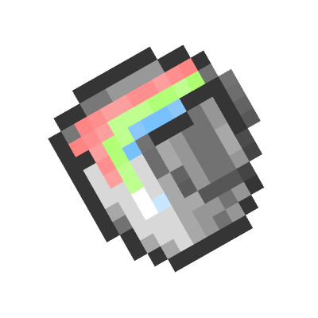
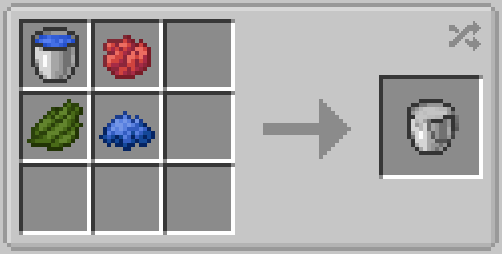
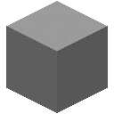
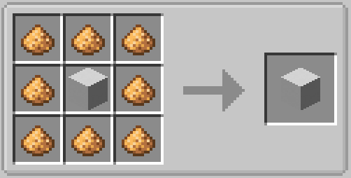
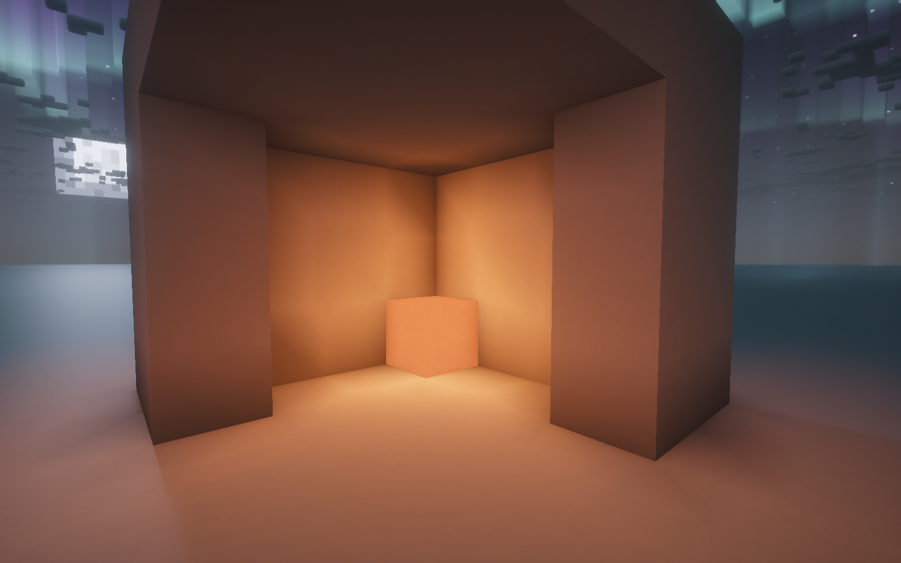
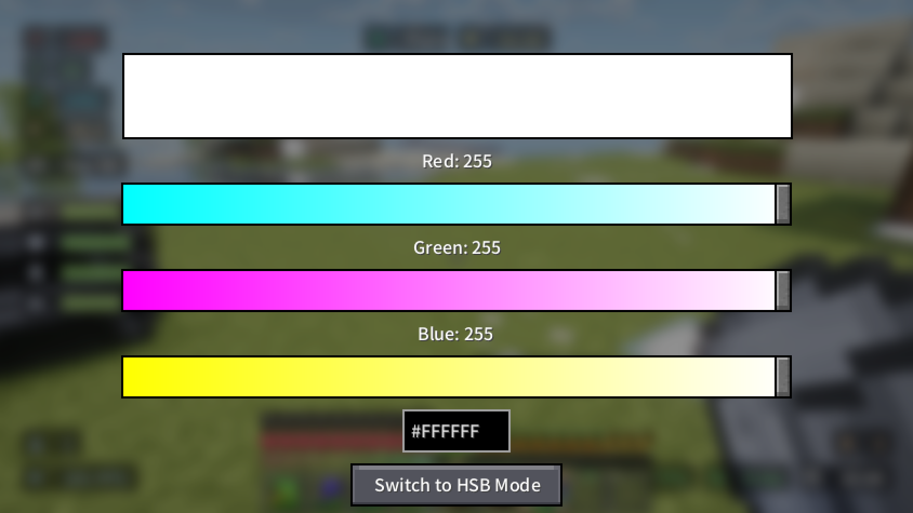
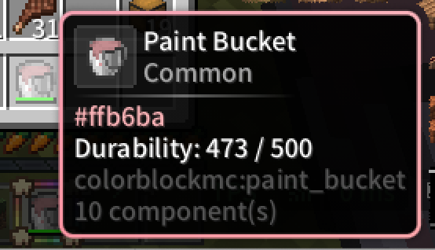

<div align="center"><center>



## Colorful Blocks

[](https://github.com/PageQwQ/ColorfulBlocks-MC)
[](https://fabricmc.net)

[![go to mcmod.cn](https://img.shields.io/badge/Go%20to-MCMOD-86C153?logo=data:image/png;base64,iVBORw0KGgoAAAANSUhEUgAAABAAAAAQCAYAAAAf8/9hAAAEDmlDQ1BrQ0dDb2xvclNwYWNlR2VuZXJpY1JHQgAAOI2NVV1oHFUUPpu5syskzoPUpqaSDv41lLRsUtGE2uj+ZbNt3CyTbLRBkMns3Z1pJjPj/KRpKT4UQRDBqOCT4P9bwSchaqvtiy2itFCiBIMo+ND6R6HSFwnruTOzu5O4a73L3PnmnO9+595z7t4LkLgsW5beJQIsGq4t5dPis8fmxMQ6dMF90A190C0rjpUqlSYBG+PCv9rt7yDG3tf2t/f/Z+uuUEcBiN2F2Kw4yiLiZQD+FcWyXYAEQfvICddi+AnEO2ycIOISw7UAVxieD/Cyz5mRMohfRSwoqoz+xNuIB+cj9loEB3Pw2448NaitKSLLRck2q5pOI9O9g/t/tkXda8Tbg0+PszB9FN8DuPaXKnKW4YcQn1Xk3HSIry5ps8UQ/2W5aQnxIwBdu7yFcgrxPsRjVXu8HOh0qao30cArp9SZZxDfg3h1wTzKxu5E/LUxX5wKdX5SnAzmDx4A4OIqLbB69yMesE1pKojLjVdoNsfyiPi45hZmAn3uLWdpOtfQOaVmikEs7ovj8hFWpz7EV6mel0L9Xy23FMYlPYZenAx0yDB1/PX6dledmQjikjkXCxqMJS9WtfFCyH9XtSekEF+2dH+P4tzITduTygGfv58a5VCTH5PtXD7EFZiNyUDBhHnsFTBgE0SQIA9pfFtgo6cKGuhooeilaKH41eDs38Ip+f4At1Rq/sjr6NEwQqb/I/DQqsLvaFUjvAx+eWirddAJZnAj1DFJL0mSg/gcIpPkMBkhoyCSJ8lTZIxk0TpKDjXHliJzZPO50dR5ASNSnzeLvIvod0HG/mdkmOC0z8VKnzcQ2M/Yz2vKldduXjp9bleLu0ZWn7vWc+l0JGcaai10yNrUnXLP/8Jf59ewX+c3Wgz+B34Df+vbVrc16zTMVgp9um9bxEfzPU5kPqUtVWxhs6OiWTVW+gIfywB9uXi7CGcGW/zk98k/kmvJ95IfJn/j3uQ+4c5zn3Kfcd+AyF3gLnJfcl9xH3OfR2rUee80a+6vo7EK5mmXUdyfQlrYLTwoZIU9wsPCZEtP6BWGhAlhL3p2N6sTjRdduwbHsG9kq32sgBepc+xurLPW4T9URpYGJ3ym4+8zA05u44QjST8ZIoVtu3qE7fWmdn5LPdqvgcZz8Ww8BWJ8X3w0PhQ/wnCDGd+LvlHs8dRy6bLLDuKMaZ20tZrqisPJ5ONiCq8yKhYM5cCgKOu66Lsc0aYOtZdo5QCwezI4wm9J/v0X23mlZXOfBjj8Jzv3WrY5D+CsA9D7aMs2gGfjve8ArD6mePZSeCfEYt8CONWDw8FXTxrPqx/r9Vt4biXeANh8vV7/+/16ffMD1N8AuKD/A/8leAvFY9bLAAAAOGVYSWZNTQAqAAAACAABh2kABAAAAAEAAAAaAAAAAAACoAIABAAAAAEAAAAQoAMABAAAAAEAAAAQAAAAABedU8gAAAGbaVRYdFhNTDpjb20uYWRvYmUueG1wAAAAAAA8eDp4bXBtZXRhIHhtbG5zOng9ImFkb2JlOm5zOm1ldGEvIiB4OnhtcHRrPSJYTVAgQ29yZSA2LjAuMCI+CiAgIDxyZGY6UkRGIHhtbG5zOnJkZj0iaHR0cDovL3d3dy53My5vcmcvMTk5OS8wMi8yMi1yZGYtc3ludGF4LW5zIyI+CiAgICAgIDxyZGY6RGVzY3JpcHRpb24gcmRmOmFib3V0PSIiCiAgICAgICAgICAgIHhtbG5zOmV4aWY9Imh0dHA6Ly9ucy5hZG9iZS5jb20vZXhpZi8xLjAvIj4KICAgICAgICAgPGV4aWY6UGl4ZWxYRGltZW5zaW9uPjY0PC9leGlmOlBpeGVsWERpbWVuc2lvbj4KICAgICAgICAgPGV4aWY6UGl4ZWxZRGltZW5zaW9uPjY0PC9leGlmOlBpeGVsWURpbWVuc2lvbj4KICAgICAgPC9yZGY6RGVzY3JpcHRpb24+CiAgIDwvcmRmOlJERj4KPC94OnhtcG1ldGE+Cpt6TVoAAAK+SURBVDgRjVNZSFVRFF37nPtMsxRUCHMgQSxoNA2jsKJyaMCggUDqI2iAROin/Kl+7KePfvrqr8CfoCIoMzXoQ7ABRVBeSAWW03MecnjPd9+9Z7fv9RUREh0499wzrbX22vsQ4q2upfwIFD8wDmcTkfNr/c+RmS3SNExMV+5WtL729pT3qXtTXk8WGpmRCxIYcMJK3duT4znKchtrXtXUA6zoemvZXk3UZpgVG/bw/tkU2ZhzdmA4fN64zppSi5hroUlx7P8uz9o7MbhwDtDJiil62wKjgI2BYVd+GYq0KCWZG1HigZI/MtuYjpVgaLFazgSgjA0mbLcMO25a4nqc3HQNjiw+Cd7D7NIEtq4rxf4NZzA49xnt/c9xdONFrE4oEeAAguNzaPg0BuF0LI9nlU5CQXoRiBR6MtrwbuAF9uSeQH56oVxgHMirRubaMrz8GvLVvB/6gZgrasVSS1b8Nh+dxlRkBIWZB9E304Oc1AJ8m+lA2M2D1rnoGp3Co+4QEi2FBE3QSi+H/AvAY+8MtSArJR8V+RcwExnDl6kB2U6BQSDuj+RdLHEkWyLMb3EFJKiJ6J/t9eMvzirHw+4esa8Y2akxLNgONmck41BemiTMMxUIToYxH3W8wiDfvPHFQURic+gcbhLjInj7PYB5W2MibONZ77iAuLhalI3LhVm4JD0jKQBXlNCN5sNdpFUhsRJZSxiLlGEqelxMMrBEr0cYdYxIF5WWTOLSXcmhIR5VoiGoNMOYCEbDlRgJV/kOexddCTQmLDoOZDsMW+a2ZADagryJj14I943kc9yuwmjkmDC5whqnkViXI/bD9tV4c6UlA+w6pKhetzf0hfJP10YnY5X7lCKLpQLlNa7YPQRlBUBKR6V6bzWd3fb0N0Hl4+AuIvemVM5uCdRd5vz7K3Wu6ANb+k7zqS0d3u5PrtxErVjdvtoAAAAASUVORK5CYII=)](https://www.mcmod.cn/class/28830.html)
[](https://modrinth.com/project/VuBMNaL4)


**ColorfulBlocks** is a Minecraft mod that lets you color blocks in **16,777,216 (24-bit RGB) colors** using a Paint Bucket tool. Right-click any vanilla concrete block to turn it into a fully customizable colored block, and use the color picker to create any shade you want.

The idea for this mod comes from [PlatinPython's RGBBlocks](https://github.com/PlatinPython/RGBBlocks). This version is built for the **Fabric Loader**.

</center></div>

## Features

- **Full RGB Color**: Choose from over 16 million colors using the color picker GUI (RGB sliders, HSB sliders, or hex input).
- **Paint Bucket**: Right-click on concrete to paint it. Shift + right-click on a painted block to copy its color. Shift + right-click in air to open the color picker.
- **Color Retention**: Color data is preserved when mined.

## Items & Blocks

<div align="center"><center>

   


### Paint Bucket

</center></div>

The bucket with 500 durability. Open color picker, paint concrete (right-click), or copy color (Shift + right-click block).

> [!note]
>
> The first time you right-click on the concrete, it won't apply color directly; you can apply color by right-clicking again.

<div align="center"><center>

   

### Stained Concrete

</center></div>

Concrete block that displays any RGB color. Drops with color data intact.

This block is created by converting vanilla concrete using the Paint Bucket.

<div align="center"><center>

   


### Glowing Stained Concrete

</center></div>

As the name suggests, it's a glowing stained concrete.

This is a variant of common stained concrete. It can help you build glowing things.

> [!tip]
>
> you can enable Screenspace Colored Blocklight in your shaderpack. This can achieve a better visual effect.

The following is the visual effect of the block at night.



## ColorPicker GUI

Paint Bucket has a GUI.

When you press Shift + Right Click and aim at something other than Stained Concrete,you will see it:



The color picker supports three input modes:

- **RGB Mode** — Red, Green, Blue sliders (0–255 each)

- **HSB Mode** — Hue (0–360°), Saturation & Brightness (0–100%)

- **Hex Input** — Direct hex color code (e.g. #FF6B35)

Toggle between RGB and HSB mode using the switch button.

## Paint Bucket Controls

| Action | Result |
|---|---|
| **Right-click** vanilla concrete | Converts it to Stained Concrete in the bucket's current color. |
| **Right-click** Stained Concrete | Recolors the block. |
| **Shift + Right-click** Stained Concrete | Copies the block's color to the bucket. |
| **Shift + Right-click** something other than Stained Concrete | Opens the color picker GUI. |
| **Right-click** with empty bucket (in dispenser) | Paints the block in front. |

## Additional support

When you install this mod along with [ModernUI](https://modrinth.com/mod/modern-ui), the tooltip box will match the color of the stained concrete or bucket.



## Requirements

| Dependency | Version |
|---|---|
| [Fabric Loader](https://fabricmc.net/) | `>=0.16.0` |
| [Fabric API](https://modrinth.com/mod/fabric-api) | `*` |
| Minecraft | `1.21.1` |
| Java | `>=21` |

## Installation

1. Install **Fabric Loader** (follow instructions on [fabricmc.net](https://fabricmc.net/)).
2. Download **Fabric API** and place it in your `mods/` folder.
3. Download the latest **ColorfulBlocks** jar from the [Releases](https://github.com/PageQwQ/ColorfulBlocks-MC/releases) page and put it in your `mods/` folder.
4. Launch the game.

## Building from Source

```sh
git clone https://github.com/PageQwQ/ColorfulBlocks-MC.git
cd ColorfulBlocks-MC
./gradlew build
```

The built jar will be in `build/libs/`.

