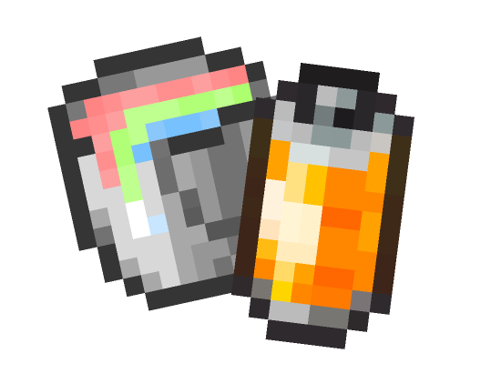
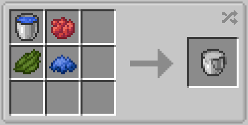
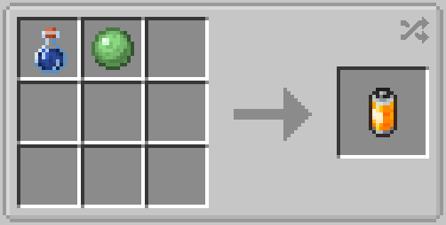
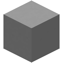
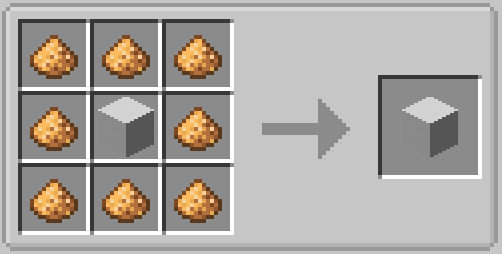
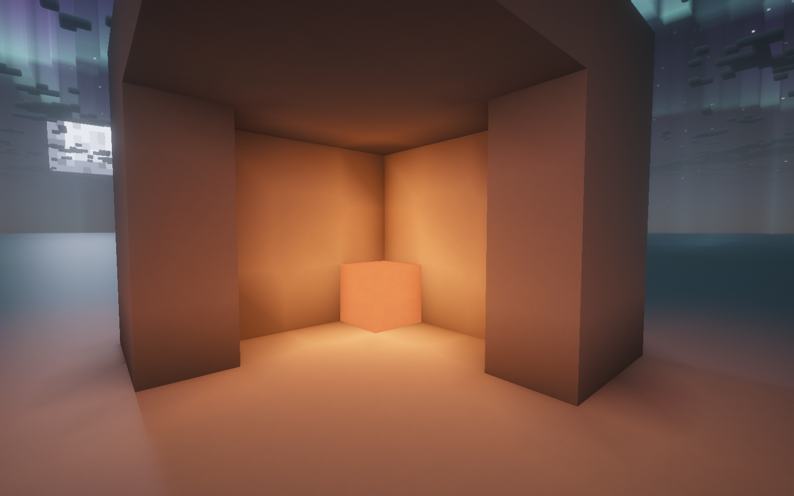
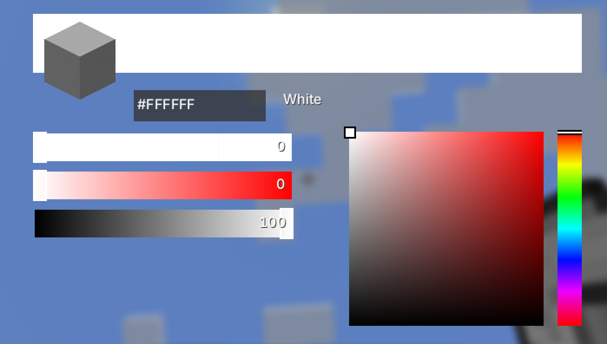
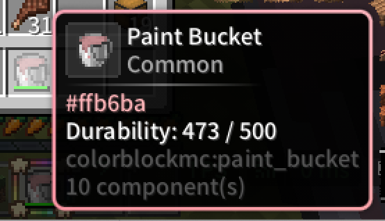

## Colorful Blocks

**ColorfulBlocks** is a Minecraft mod that lets you color blocks in **16,777,216 (24-bit RGB) colors** using a Paint Bucket tool. Right-click any vanilla concrete block to turn it into a fully customizable colored block, and use the color picker to create any shade you want.

The idea for this mod comes from [PlatinPython's RGBBlocks](https://github.com/PlatinPython/RGBBlocks). This version is built for the **Fabric Loader**.

## Features

- **Full RGB Color**: Choose from over 16 million colors using the color picker GUI (RGB sliders, HSB sliders, or hex input).
- **Paint Bucket**: Right-click on concrete to paint it. Shift + right-click on a painted block to copy its color. Shift + right-click in air to open the color picker.
- **Color Retention**: Color data is preserved when mined.
- **`/givec` Command**: Give yourself a stained concrete block of any hex color directly (e.g. `/givec #FF6B35`). Requires cheats/operator permission.

## Items & Blocks

   

### Paint Bucket

The bucket with 500 durability. Open color picker, paint concrete (right-click), or copy color (Shift + right-click block).

> [!note]
>
> The first time you right-click on the concrete, it won't apply color directly; you can apply color by right-clicking again.

   

### Clean Agent

Right-click on the Stained concrete to use. Shift the color 25% closer to white each time. *The darker the color, the more clicks are required.*

It has 120 Durability; consumes 1 point per use. No further consumption occurs after turning completely white. 

   

### Stained Concrete

Concrete block that displays any RGB color. Drops with color data intact.

This block is created by converting vanilla concrete using the Paint Bucket.

   

### Glowing Stained Concrete

As the name suggests, it's a glowing stained concrete.

This is a variant of common stained concrete. It can help you build glowing things.

> [!tip]
>
> you can enable Screenspace Colored Blocklight in your shaderpack. This can achieve a better visual effect.

## GUI

Paint Bucket has a GUI.

When you press Shift + Right Click and aim at something other than Stained Concrete,you will see it:

This interface displays a color alongside its appearance on dyed concrete; it shows the color name based on the entered HEX value and allows for color adjustment using HSB sliders and a square color picker.

## Paint Bucket Controls

| Action | Result |
|---|---|
| **Right-click** vanilla concrete | Converts it to Stained Concrete in the bucket's current color. |
| **Right-click** Stained Concrete | Recolors the block. |
| **Shift + Right-click** Stained Concrete | Copies the block's color to the bucket. |
| **Shift + Right-click** something other than Stained Concrete | Opens the color picker GUI. |
| **Right-click** with empty bucket (in dispenser) | Paints the block in front. |

## `/givec` Command

Give yourself a stained concrete block of any color directly, no Paint Bucket needed. Requires **cheats / operator permission (level 2)**.

| Command | Result |
|---|---|
| `/givec <color>` | Gives 1 Stained Concrete of that color. |
| `/givec <color> <count>` | Gives the specified amount. |
| `/givec <color> <count> <glowing>` | Set `<glowing>` to `true` for Glowing Stained Concrete. |

`<color>` is a hex color code, with or without the leading `#` (e.g. `#FF6B35` or `FF6B35`).

Example: `/givec #FF6B35 16 true` gives you 16 Glowing Stained Concrete blocks colored `#FF6B35`.

## Additional support

When you install this mod along with [ModernUI](https://modrinth.com/mod/modern-ui), the tooltip box will match the color of the stained concrete or bucket.

